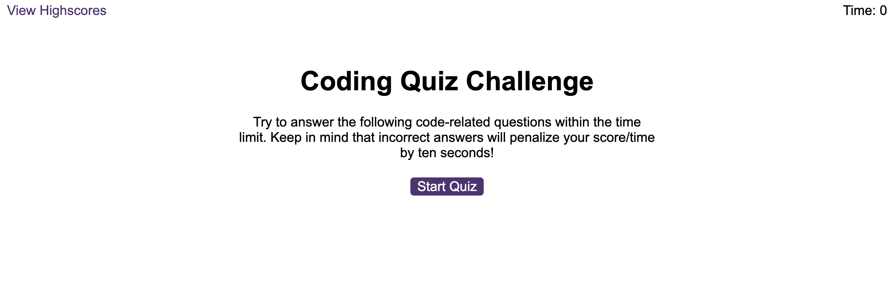

# rupesh-code-quiz
This is my application for the timed code quiz challenge

## Description

This project was created to create an application that user can to play code quiz challenge in time:

All the question are related with the coding, which will be helpful to the user to challegne themselves.

These helps user to test their knowledge and helps the gain more confident.

The main things I have learned from this project are how to use web API, eventListener, function, setInterval in JavaScript.

[Link to my deployed web page](https://rrana5106.github.io/Rupesh-Password-Generator/)

## Installation
N/A

## Usage
Below is a screenshot of the published webpage:

## Credits
N/A

## License
N/A
